

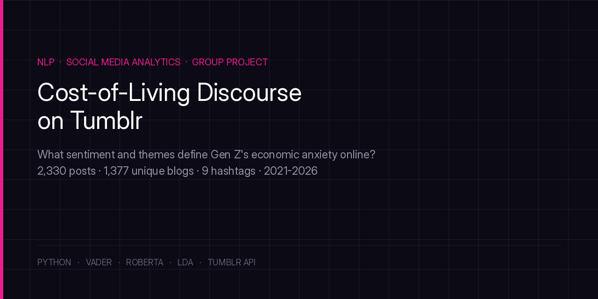

# Understanding Cost-of-Living Discourse on Tumblr

> A platform-wide sentiment and thematic analytics study

**Collaborative analytics project** — contributed as part of a project team, working with a client-facing brief for a social platform's content and community health function.

---

## Client & Consulting Track

**Track 1: Platform Manager-Facing Analytics**
Client: Tumblr Platform Management Team — responsible for content governance, trend intelligence, and community health monitoring.

**Scope:** Platform-wide posts via the Tumblr API v2 `/tagged` endpoint. 2,330 posts across 1,377 unique blogs, 2021–2026, spanning 9 cost-of-living-related hashtags.

## Business Context

Since 2021, the cost-of-living crisis has become one of the defining social issues for Gen Z and Millennials, who make up Tumblr's core user base. Inflation, record rents, student debt, and wage stagnation drive sustained, high-volume discourse tagged with `#costofliving`, `#rent`, `#studentloans`, `#housingcrisis`, and related hashtags.

Tumblr's platform team lacked automated tools to monitor sentiment, thematic structure, and engagement dynamics at scale. This project addressed that gap with a three-component NLP pipeline:

- **Sentiment classification** — VADER (lexicon baseline) + RoBERTa (transformer-based) across 9 economic hashtags
- **Thematic topic modeling** — LDA to surface major cost-of-living sub-themes
- **Engagement analysis** — linking sentiment to note counts (likes + reblogs)

**Core research question:** *What sentiment do Tumblr users express toward cost-of-living topics, which thematic sub-categories drive the strongest emotional reactions, and how do sentiment and engagement vary across topics?*

---

## Data Collection & Cleaning

- Source: Tumblr API v2 `/tagged` endpoint, timestamp-based pagination (Jan 2021 → Apr 2026)
- Target: up to 500 posts per tag · plain text only · deduplicated

| Cleaning Step | Filter | Posts Remaining |
|---|---|---|
| 1 | Remove <50-char posts | ~2,900 |
| 2 | Remove spam / commercial content | ~2,700 |
| 3 | Remove off-topic noise | ~2,500 |
| 4 | Require economic keyword | ~2,400 |
| 5 | Deduplicate repeated text | 2,330 |

### Hashtags Collected

| Hashtag | Posts | Thematic Focus |
|---|---|---|
| #cost of living | 314 | Broad financial stress & personal commentary |
| #student loans | 295 | Loan repayment, forgiveness debates, policy |
| #student debt | 288 | Debt burden, credit impact, borrower stories |
| #mortgage | 280 | Rates, homeownership barriers, market dynamics |
| #wages | 260 | Wage stagnation, fair pay, minimum wage |
| #groceries | 242 | Price inflation, food insecurity, shopping |
| #housing crisis | 239 | Systemic unaffordability, homelessness, policy |
| #affordability | 227 | General affordability across housing, food, care |
| #rent | 185 | Rental costs, landlord relations, eviction |

---

## Key Findings

### Sentiment Landscape
- **Housing Crisis is the most negative topic.** Mean sentiment sits at −0.15, with 56.5% of posts reading Negative. Users express systemic despair here more than on any other economic topic.
- **Mortgage and Groceries are the most positive**, at +0.47 and +0.40. Both are driven by aspiration, deal-sharing, and coping humor rather than genuine optimism about the underlying issue.
- **Student loans and debt sit in contested territory**, roughly 43% Negative and 52% Positive. Frustration with the system coexists with hope for policy relief.

| Topic | Mean Sentiment | % Negative | % Positive | Interpretation |
|---|---|---|---|---|
| Housing Crisis | -0.152 | 56.5% | 38.9% | Most negative topic: systemic despair |
| Student Loans | +0.061 | 42.7% | 51.9% | Divided: hope vs. policy frustration |
| Student Debt | +0.073 | 43.1% | 54.2% | Similar split to student loans |
| Wages | +0.082 | 35.8% | 45.8% | Cautious optimism, stagnation anger |
| Cost of Living | +0.097 | 39.5% | 51.9% | Broad frustration with positive coping |
| Affordability | +0.262 | 30.4% | 59.5% | More solution-focused framing |
| Rent | +0.323 | 25.9% | 62.7% | Community solidarity posts dominate |
| Groceries | +0.401 | 19.8% | 67.4% | Deal-sharing and humor offset complaints |
| Mortgage | +0.468 | 20.0% | 71.4% | Most positive — homeownership aspiration |

### Model Comparison — VADER vs. RoBERTa

Across the full 2,330-post corpus, VADER and RoBERTa agreed on sentiment label only **45.5%** of the time. On a manually labeled validation sample (n=200), RoBERTa substantially outperformed VADER:

| Metric | VADER | RoBERTa |
|---|---|---|
| Overall Accuracy | 23.5% | 49.5% |
| Weighted F1 | 0.26 | 0.55 |
| Neutral Recall | 13% | 46% |

This gap reflects a known limitation of lexicon-based sentiment tools. VADER fires on individual words like "free," "forgiveness," and "progress" without parsing irony, while much of Tumblr's cost-of-living discourse is informational, dry, or ironic. A good example is the post *"record profits are unpaid wages"* (34,211 notes), which is clearly a negative economic claim. VADER scored it Positive. RoBERTa correctly labeled it Neutral.

### LDA Topic Modeling

Five substantive topics emerged after excluding a spam cluster:

| Topic | Posts | Top Keywords | Mean Sentiment |
|---|---|---|---|
| Housing & Wage Pressure | 1,211 | housing, rent, wages, living, time | +0.023 |
| Student Debt Policy | 499 | student, loan, debt, education, forgiveness | +0.109 |
| Housing Market & Rentals | 200 | mortgage, rental, rates, market, financial | +0.469 |
| Mortgage & Credit Stress | 92 | loan, mortgage, credit, rate, payment | +0.470 |
| Groceries & Daily Costs | 262 | grocery, quality, store, delivery | +0.515 |

**Housing & Wage Pressure dominates at 52% of all posts.** It also has the lowest mean sentiment of any topic, though the number itself is only slightly negative. That points to sustained ambivalence rather than acute crisis language.

### Engagement vs. Sentiment

Posts in the moderately-positive sentiment quartile generate the highest mean engagement, 107 notes on average versus 31 for the most-negative quartile. That said, all quartile *medians* sit near zero, which reflects Tumblr's extreme power-law engagement distribution. A small number of viral posts are driving those mean differences, not a broad shift in typical engagement.

**Notable case:** the #housingcrisis tag is simultaneously the most negative topic overall (56.5% Negative) and home to the highest mean note count among positive posts (322 average). Two viral posts, 17,508 and 11,093 notes, about hopeful, solution-oriented housing content are responsible for that. On average, negative content reaches more people, but positive content produces the largest individual spikes.

---

## Charts & Visuals

**Data Collection**
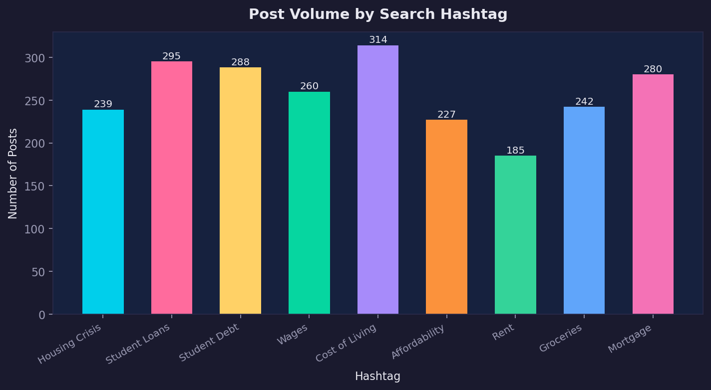
*Posts collected per hashtag: 2,330 total across 9 economic tags.*

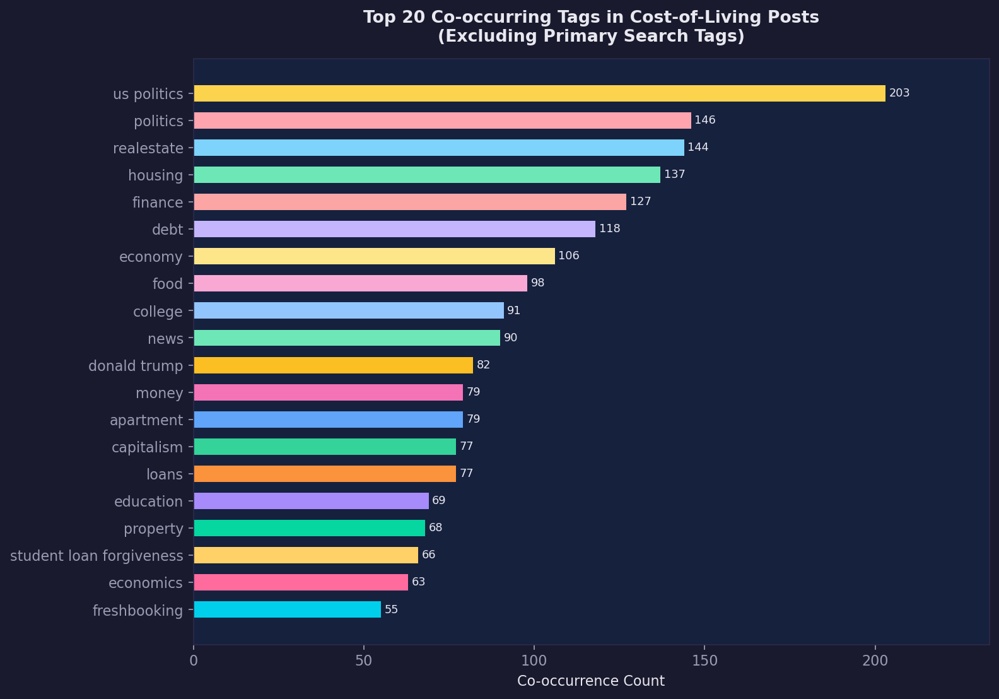
*The top 20 tags appearing alongside cost-of-living posts. Politics, real estate, and finance dominate, so this reads as a systemic conversation rather than individual complaints.*

**Sentiment Analysis**
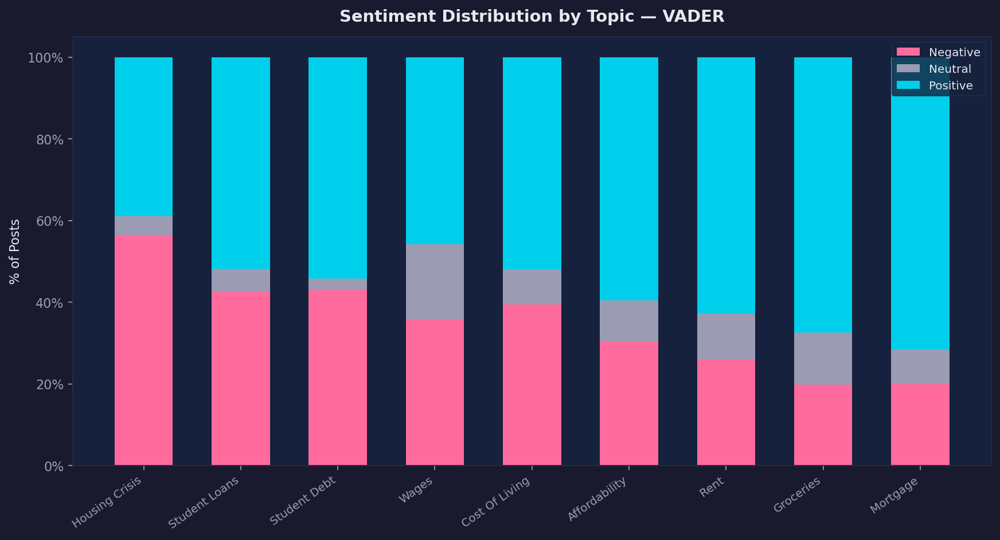
*Sentiment breakdown by topic using VADER.*

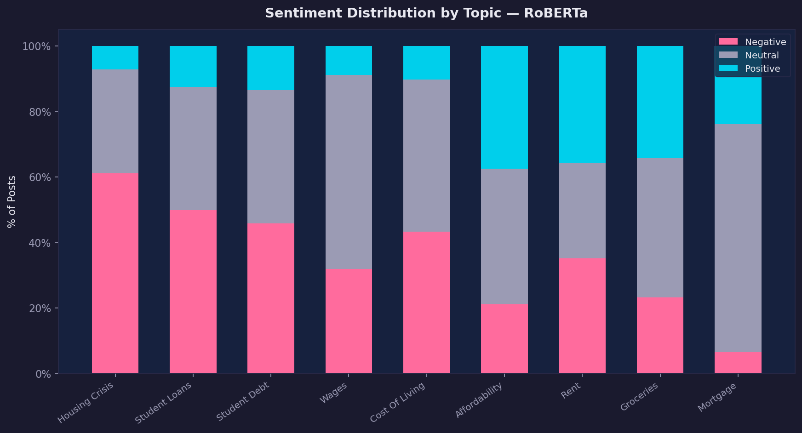
*The same breakdown using RoBERTa. It classifies a much larger share of posts as Neutral than VADER does.*

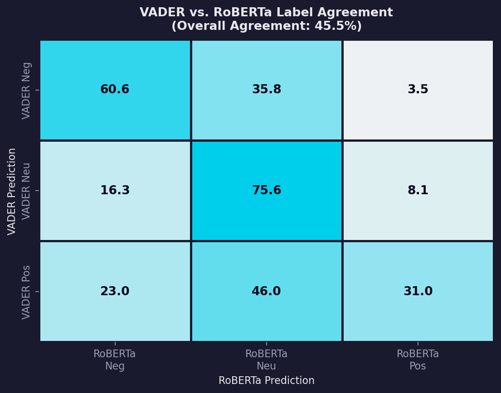
*A row-normalized heatmap comparing the two models. They only agree on 45.5% of posts.*

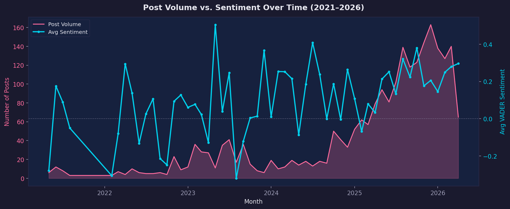
*Post volume and sentiment plotted from 2021 to 2026. Sentiment dips lowest right when volume spikes.*

**Topic Modeling**
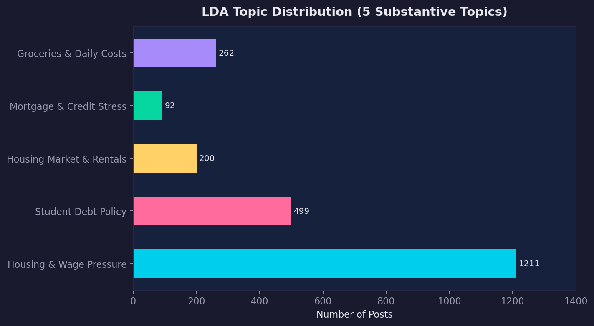
*How posts split across the five LDA topics. Housing & Wage Pressure makes up 52% of the corpus on its own.*

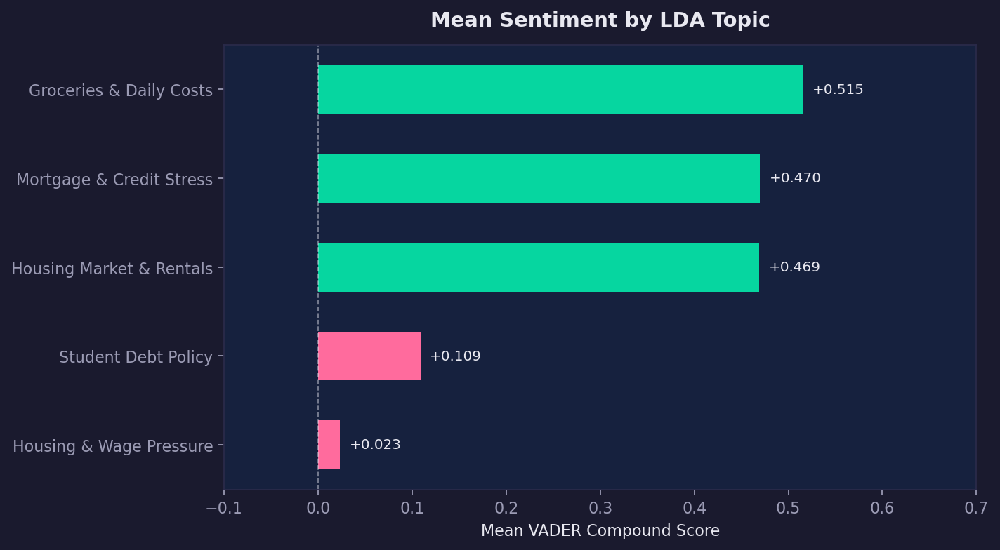
*Average sentiment score for each topic. Housing & Wage Pressure is the only one sitting near neutral to negative; everything else skews positive.*

**Engagement**
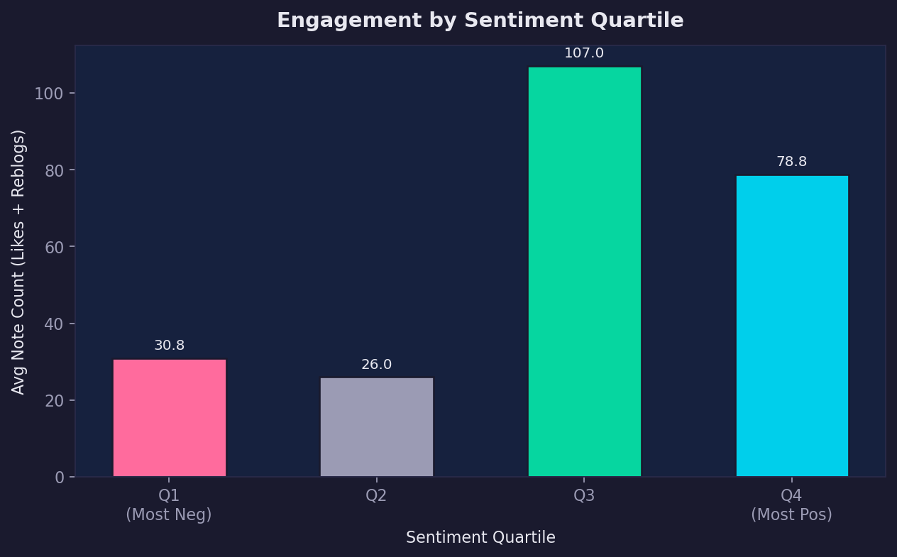
*Average likes and reblogs by sentiment quartile. Moderately positive posts get the most engagement overall.*

**Model Validation**
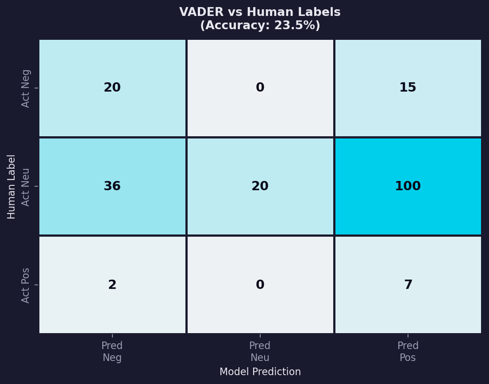
*VADER tested against a manually labeled sample of 200 posts: 23.5% accuracy.*

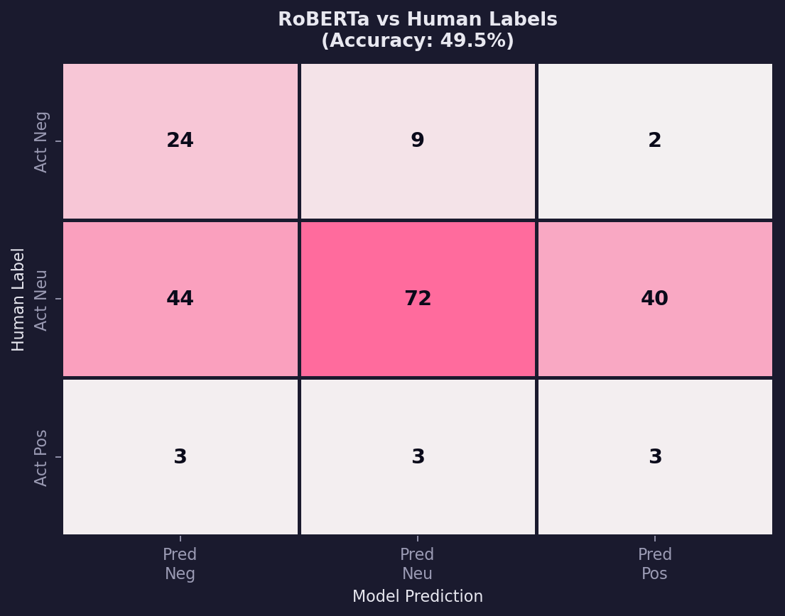
*RoBERTa on the same sample: 49.5% accuracy.*

---

## Business Value Delivered

| Capability | Business Value for Tumblr |
|---|---|
| Sentiment Monitoring | Structured view of emotional engagement with cost-of-living content; track mood shifts over time |
| Thematic Intelligence | Identifies which economic dimensions (housing, debt, wages) resonate most strongly with users |
| Engagement Insights | Moderately-positive posts drive the highest mean engagement; identifies viral ceiling patterns |
| Scalable Pipeline | Replicable methodology across any high-volume social issue on the platform |
| Community Health | Early detection of surges in negative sentiment around emerging economic flashpoints |

## Strategic Recommendations

| Recommendation | Rationale | Priority |
|---|---|---|
| Deploy RoBERTa-based sentiment monitoring dashboard | Real-time tracking of economic discourse emotional health | High |
| Flag housing crisis sentiment spikes for review | Most negative topic; surges may signal emerging community crises | High |
| Surface moderately-positive economic content in feeds | 107-note mean vs. 31-note mean supports engagement uplift | Medium |
| Build topic-tagged content recommendation system | LDA topics align with distinct community interests and sentiment profiles | Medium |

---

## Limitations

- Engagement means are heavily skewed by viral outliers; median note counts are near zero across all groups, limiting reliable inference from subgroup mean comparisons
- API rate limits constrained collection to ~500 posts per tag; higher-volume tags may be biased toward recent content
- Text-only analysis misses image, GIF, and video content, which constitutes a significant portion of Tumblr posts
- Manual validation sample is class-imbalanced (78% Neutral), limiting Positive/Negative class evaluation

## Future Work

- BERTopic for more coherent, temporally-trackable topic clusters
- Larger, class-balanced validation set for improved Positive/Negative evaluation
- Domain-adapted sentiment model fine-tuned specifically on Tumblr economic discourse
- Multimodal analysis — image captioning + sentiment fusion

---

## Tools & Technologies

| Category | Tools |
|---|---|
| Data Collection | Python, Tumblr API v2 |
| Sentiment Analysis | VADER, RoBERTa (cardiffnlp/twitter-roberta-base-sentiment-latest) |
| Topic Modeling | scikit-learn (LDA, CountVectorizer) |
| Analysis | pandas, numpy |

---

## About

A collaborative analytics project, built with a project team.

Tanya Patel is an MS Business Analytics Candidate at Simon Business School, University of Rochester (December 2026), targeting business analyst and data analytics roles in entertainment, beauty, luxury, retail, and CPG industries.

[LinkedIn](https://www.linkedin.com/in/tanyapatel23/) | [Email](mailto:tpatel18@simon.rochester.edu)
